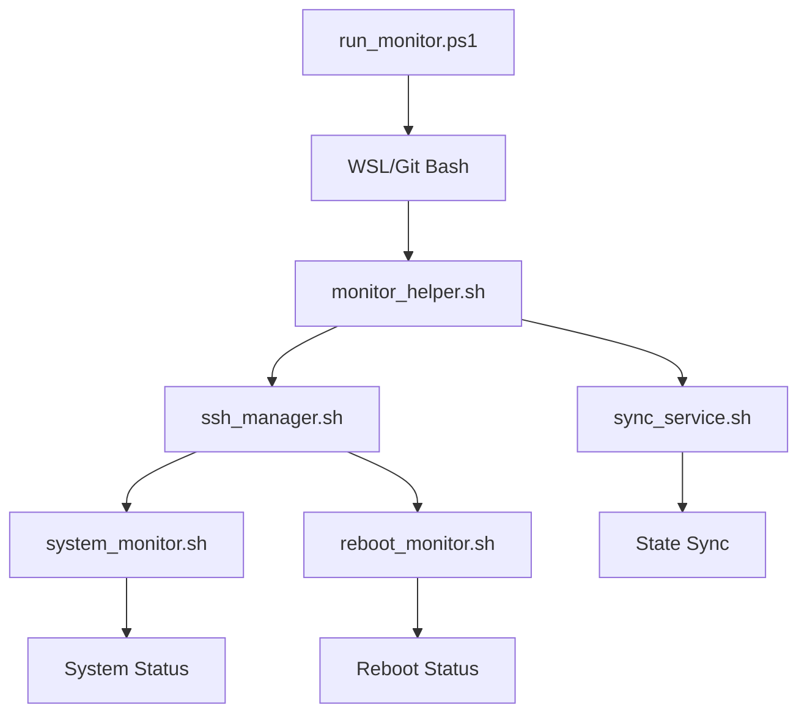

# Service Architecture

## System Overview

The SSH Dashboard Monitor is a service-based system designed to monitor and manage SSH connections and system states. It consists of several interconnected components working together to provide comprehensive monitoring and management capabilities.

## Core Components

### 1. Entry Points
#### Windows Entry (run_monitor.ps1)
- Environment detection (WSL/Git Bash)
- Service management interface
- Configuration validation
- PowerShell-based helper functions

#### Unix/WSL Entry (monitor_helper.sh)
- Interactive menu system
- Direct service control
- System status overview
- Configuration management

### 2. Service Layer

#### SSH Manager Service (ssh_manager.sh)
- Connection management
- Key setup and validation
- Port forwarding control
- Status monitoring
- Configuration handling

#### Background Sync Service (sync_service.sh)
- Continuous state synchronization
- Lock file management
- Error handling and recovery
- Log management
- Process isolation

### 3. Monitoring Components

#### System Monitor (system_monitor.sh)
- Resource monitoring
  - CPU usage
  - Memory status
  - Disk usage
  - Network status
- Service status tracking
- Error detection
- Performance metrics

#### Reboot Monitor (reboot_monitor.sh)
- Pre-reboot state capture
- Post-reboot verification
- State comparison
- Change detection
- Recovery procedures

## Service Interaction Flow



## Service Management

### Process Control
```bash
# Service start
./monitor_helper.sh start

# Service stop
./monitor_helper.sh stop

# Service status
./monitor_helper.sh status
```

### Lock Management
- Lock file: /var/lock/sync_service.lock
- Process isolation
- Crash recovery
- Resource cleanup

### Error Handling
1. Connection failures
2. Permission issues
3. Resource constraints
4. Configuration errors

## Configuration Management

### File Structure
```
/config/
  ├── ssh_config.yml      # SSH configuration
  ├── monitor_config.yml  # Monitoring settings
  ├── service_config.yml  # Service parameters
  └── user_config.yml     # User preferences
```

### Configuration Parameters
1. SSH Settings
   - Host information
   - Key locations
   - Port configurations
   - Timeout values

2. Monitor Settings
   - Update intervals
   - Resource thresholds
   - Alert configurations
   - Log levels

3. Service Parameters
   - Process limits
   - Lock file locations
   - Backup settings
   - Recovery options

## Security Considerations

### SSH Security
- Key management
- Permission handling
- Connection encryption
- Port security

### Service Security
- Process isolation
- Resource limitations
- Error containment
- Log security

## Logging and Monitoring

### Log Structure
```
/logs/
  ├── ssh_manager.log     # SSH operations
  ├── sync_service.log    # Sync operations
  ├── system_monitor.log  # System status
  └── error.log          # Error tracking
```

### Monitoring Metrics
1. Connection status
2. Sync status
3. System resources
4. Error rates
5. Performance metrics

## Recovery Procedures

### Service Recovery
1. Lock file cleanup
2. Process termination
3. State restoration
4. Log analysis

### Connection Recovery
1. SSH retry logic
2. Key validation
3. Port verification
4. State synchronization

## Future Considerations

### Scalability
- Multiple host support
- Clustered monitoring
- Load distribution
- Resource optimization

### Integration
- External monitoring tools
- Alert systems
- Backup services
- Analytics platforms
