# SSH Dashboard Monitor - File Dependency Map

## Core System Dependencies

### 1. System Monitor Chain
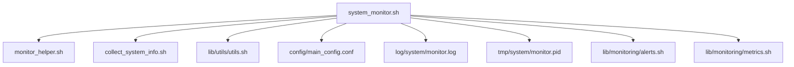

### 2. Orchestration Chain
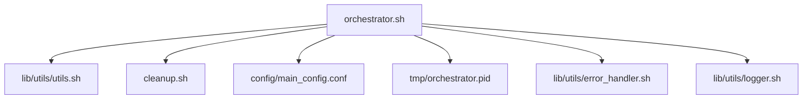

### 3. System Information Chain
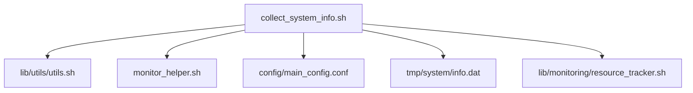

### 4. Reboot Monitor Chain
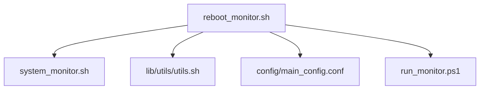

## SSH Management Dependencies

### 1. SSH Setup Chain
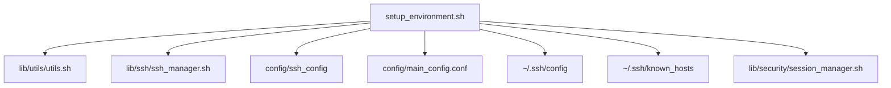

### 2. SSH Authentication Chain
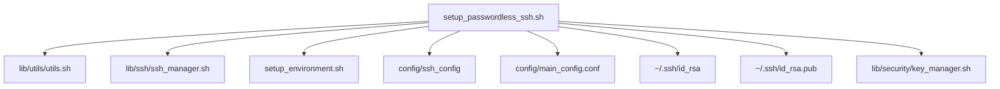

### 3. SSH Control Chain
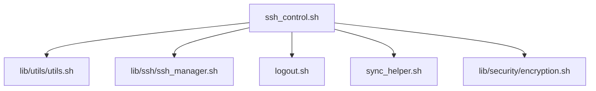

### 4. SSH Recovery Chain
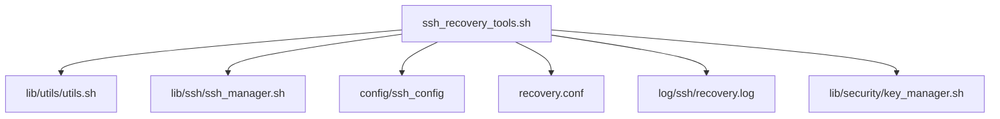

## Utility Dependencies

### 1. Utils Chain
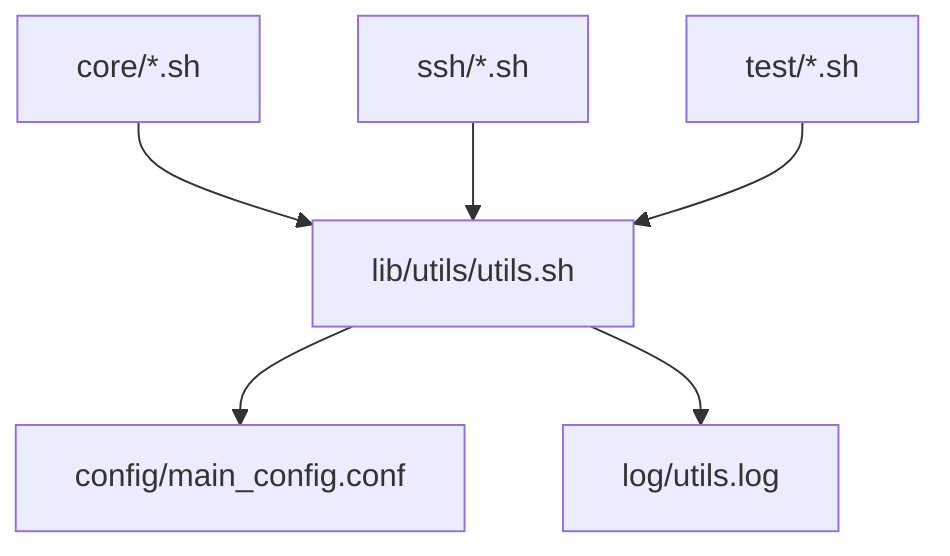

### 2. Cleanup Chain
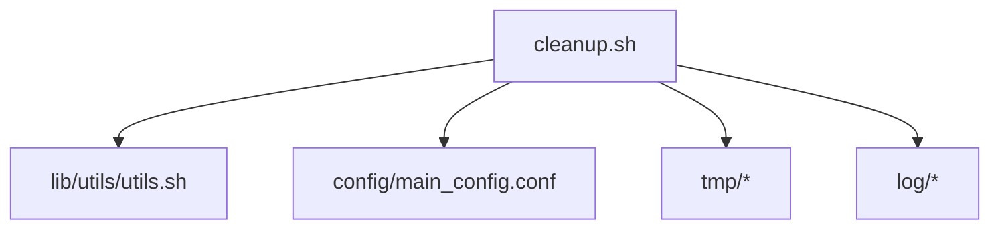

### 3. Diagnostic Chain
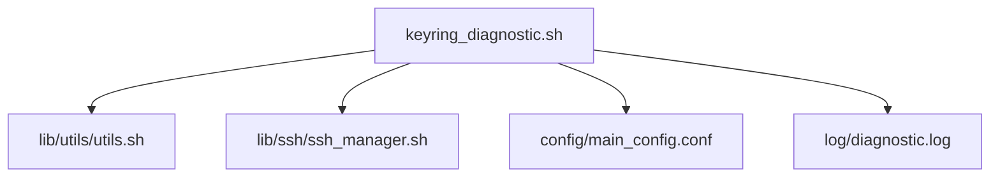

## Library Dependencies

### 1. Monitoring Libraries
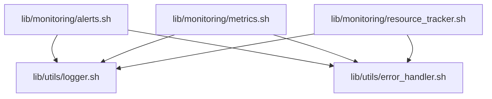

### 2. Security Libraries
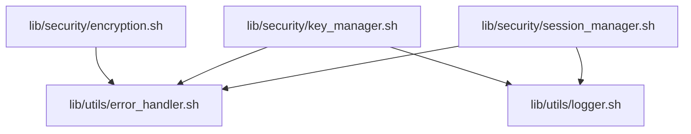

### 3. Utility Libraries
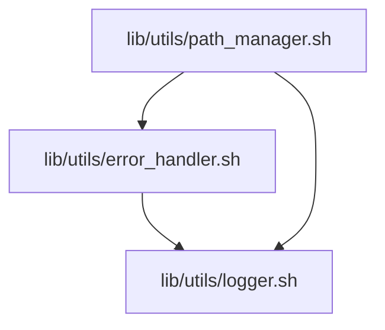

## Test Dependencies

### 1. Integration Test Chain
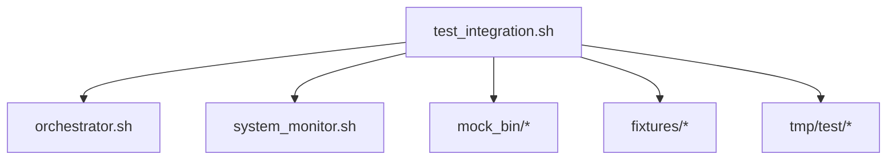

### 2. Security Test Chain
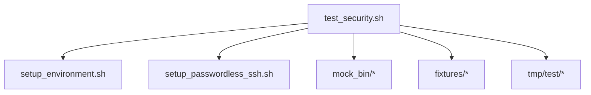

### 3. Test Toolkit Chain
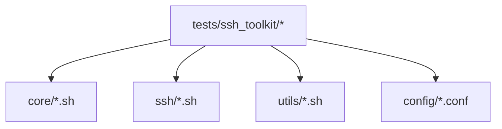

## Project Setup Dependencies

### 1. Setup Chain
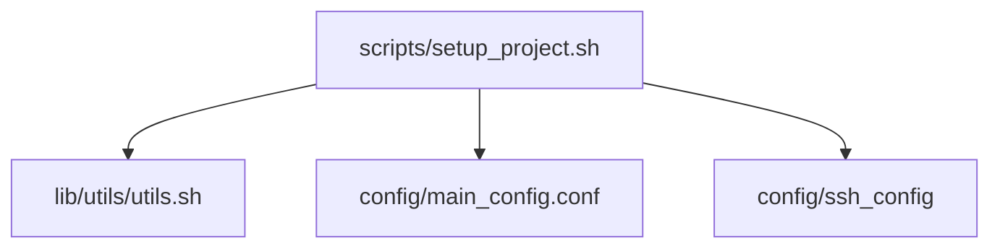

### 2. IDE Setup Chain
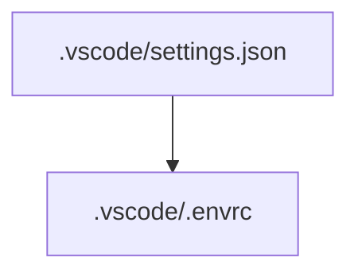

## Configuration Dependencies

### 1. Main Config Usage
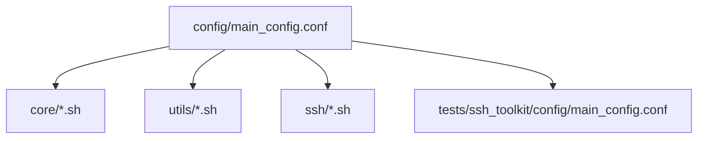

### 2. SSH Config Usage
```mermaid
graph TD
    A[config/ssh_config] --> B[setup_environment.sh]
    A --> C[setup_passwordless_ssh.sh]
    A --> D[lib/ssh/ssh_manager.sh]
    A --> E[tests/ssh_toolkit/config/ssh_config]
```

## Documentation Dependencies

### 1. Documentation Structure
```mermaid
graph TD
    A[docs/README.md] --> B[docs/Architecture/*]
    A --> C[docs/Guides/*]
    A --> D[docs/Tests/*]
    A --> E[docs/Todo/*]
```

### 2. Test Documentation
```mermaid
graph TD
    A[docs/Tests/*] --> B[tests/done/*]
    A --> C[tests/ssh_toolkit/*]
    A --> D[tests/fixtures/*]
```

## File Creation Map

### 1. Log Files
```
Created by:
├── system_monitor.sh    → log/system/monitor.log
├── ssh_recovery_tools.sh → log/ssh/recovery.log
├── lib/utils/utils.sh   → log/utils.log
├── lib/utils/logger.sh  → log/*.log
└── keyring_diagnostic.sh → log/diagnostic.log
```

### 2. Temporary Files
```
Created by:
├── system_monitor.sh    → tmp/system/monitor.pid
├── orchestrator.sh      → tmp/orchestrator.pid
├── collect_system_info.sh → tmp/system/info.dat
├── lib/monitoring/*     → tmp/monitoring/*
└── test scripts         → tmp/test/*
```

### 3. SSH Files
```
Created by:
├── setup_environment.sh → ~/.ssh/config, known_hosts
├── setup_passwordless_ssh.sh → ~/.ssh/id_rsa, id_rsa.pub
└── lib/security/key_manager.sh → ~/.ssh/authorized_keys
```

### 4. Test Files
```
Created by:
├── test_integration.sh → tmp/test/integration/*
├── test_security.sh → tmp/test/security/*
└── tests/ssh_toolkit/* → tmp/test/toolkit/*
```

### 5. Configuration Files
```
Created by:
├── scripts/setup_project.sh → config/main/config.conf
└── setup_environment.sh → config/ssh/ssh_config
```

## Critical Path Analysis

### 1. Most Depended Upon
1. lib/utils/utils.sh (Used by all scripts)
2. config/main_config.conf (Used by all scripts)
3. lib/ssh/ssh_manager.sh (Used by all SSH scripts)
4. lib/utils/logger.sh (Used by all libraries)
5. lib/utils/error_handler.sh (Used by all libraries)
6. tests/ssh_toolkit/* (Used by integration tests)

### 2. Most Dependencies
1. setup_passwordless_ssh.sh
   - Requires 8 other files
2. ssh_control.sh
   - Requires 6 other files
3. system_monitor.sh
   - Requires 6 other files
4. lib/monitoring/alerts.sh
   - Requires 4 other files
5. test_integration.sh
   - Requires 4 other files
6. setup_environment.sh
   - Requires 4 other files

### 3. Critical Chains
1. SSH Setup Chain:
   ```
   setup_passwordless_ssh.sh
   └── setup_environment.sh
       └── lib/ssh/ssh_manager.sh
           └── lib/security/key_manager.sh
               └── lib/utils/error_handler.sh
                   └── lib/utils/logger.sh
   ```

2. System Monitor Chain:
   ```
   system_monitor.sh
   ├── lib/monitoring/alerts.sh
   │   └── lib/utils/logger.sh
   └── lib/monitoring/metrics.sh
       └── lib/utils/error_handler.sh
   ```

3. Control Chain:
   ```
   ssh_control.sh
   ├── lib/ssh/ssh_manager.sh
   │   └── lib/security/session_manager.sh
   └── sync_helper.sh
       └── lib/security/encryption.sh
   ```

4. Test Integration Chain:
   ```
   test_integration.sh
   ├── orchestrator.sh
   │   └── lib/utils/utils.sh
   └── system_monitor.sh
       └── monitor_helper.sh
   ```

## Implementation Requirements

### 1. File Order
Files must be implemented in this order:
1. lib/utils/logger.sh
2. lib/utils/error_handler.sh
3. lib/utils/path_manager.sh
4. lib/security/*.sh
5. lib/monitoring/*.sh
6. lib/utils/utils.sh
7. Core system files
8. SSH operation files
9. Test files
10. IDE configuration

### 2. Testing Order
Tests must be run in this order:
1. Library unit tests
2. Utility unit tests
3. Core system tests
4. SSH operation tests
5. Integration tests
6. Security tests
7. Test toolkit validation

### 3. Library Implementation
Libraries must be implemented in this order:
1. Utility libraries (logging, errors)
2. Security libraries (encryption, keys)
3. Monitoring libraries (metrics, alerts)
4. Main utilities (utils.sh)

### 4. Configuration Order
Configuration must be implemented in this order:
1. IDE settings (.vscode/*)
2. Main config (config/main/*)
3. SSH config (config/ssh/*)
4. Library configs (lib/*/config)

### 5. Documentation Order
Documentation must be updated in this order:
1. Technical architecture
2. User guides
3. Test specifications
4. Development plans

## Notes
1. Empty .sh files are preserved as they represent planned functionality
2. All dependencies flow through utils.sh as the core utility library
3. Configuration files are central dependencies for all components
