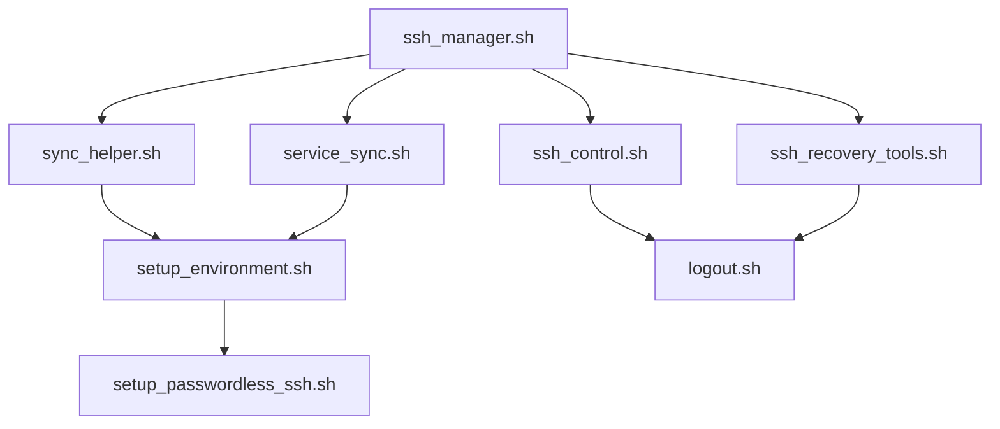

# SSH Dashboard Monitor Module Structure

This document outlines the purpose and relationships between the various SSH-related modules in the system.

## Core Modules

### ssh_manager.sh
- Main SSH connection management
- Handles connection establishment and monitoring
- Coordinates between other modules

### ssh_control.sh
- Basic SSH connection control interface
- Provides user-facing commands
- Simple menu-driven interface

## Synchronization Modules

### sync_helper.sh
- File-level synchronization
- Port forwarding management
- File system monitoring
- Directory synchronization

### service_sync.sh
- Service-level synchronization
- Monitors systemd service states
- Syncs service configurations
- Handles service state mismatches

## Setup and Configuration

### setup_environment.sh
- Environment setup and validation
- Configuration validation
- System requirements checking

### setup_passwordless_ssh.sh
- SSH key generation and distribution
- Key-based authentication setup
- SSH agent configuration

## Recovery and Maintenance

### ssh_recovery_tools.sh
- Connection recovery mechanisms
- Backup and restore functionality
- Error handling and recovery

### logout.sh
- Clean session termination
- Resource cleanup
- Connection state management

## Module Dependencies

## Key Differences

1. File vs Service Sync:
   - `sync_helper.sh`: Handles file-level operations (copying, monitoring, port forwarding)
   - `service_sync.sh`: Manages service states and configurations (systemd services)

2. Setup vs Runtime:
   - Setup modules (`setup_*.sh`): One-time configuration and initialization
   - Runtime modules (others): Ongoing operation and monitoring

3. User Interface vs Background:
   - Interactive (`ssh_control.sh`): User-facing commands and menus
   - Background (`service_sync.sh`, `sync_helper.sh`): Automated operations